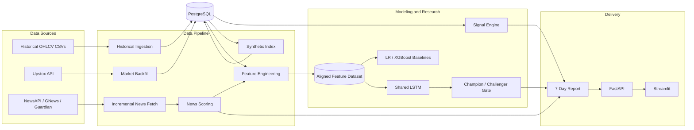
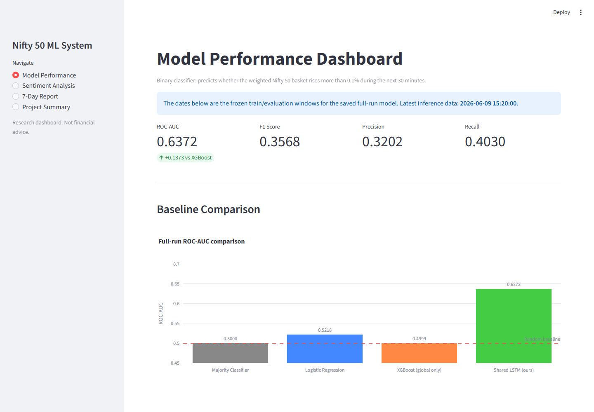
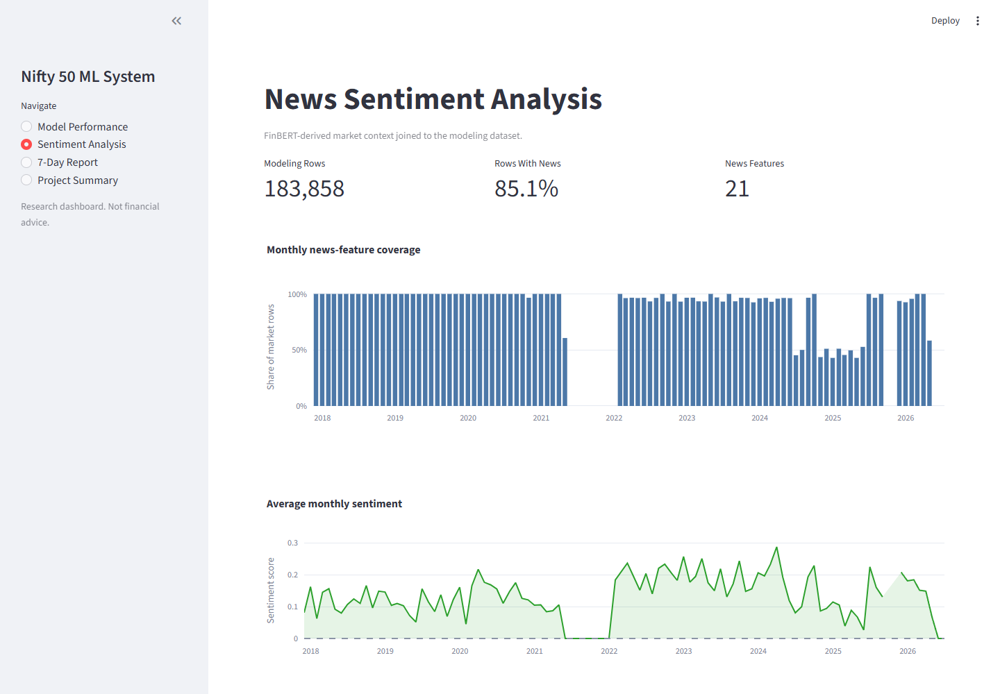
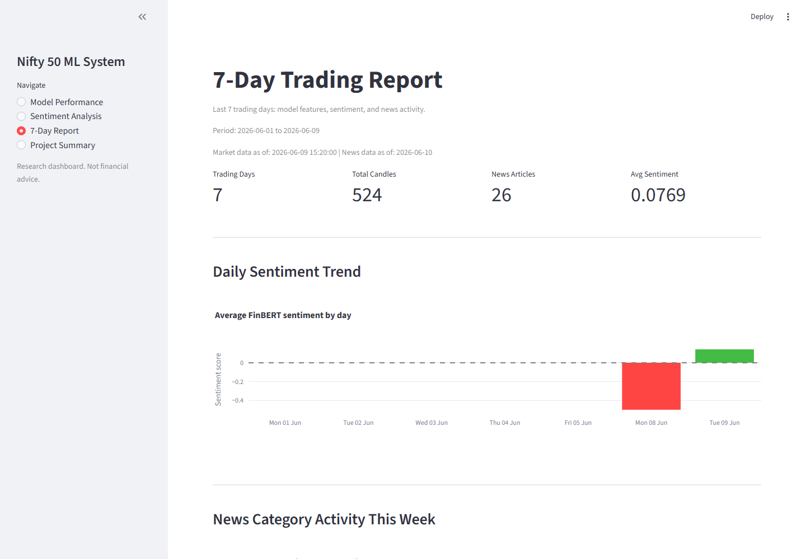
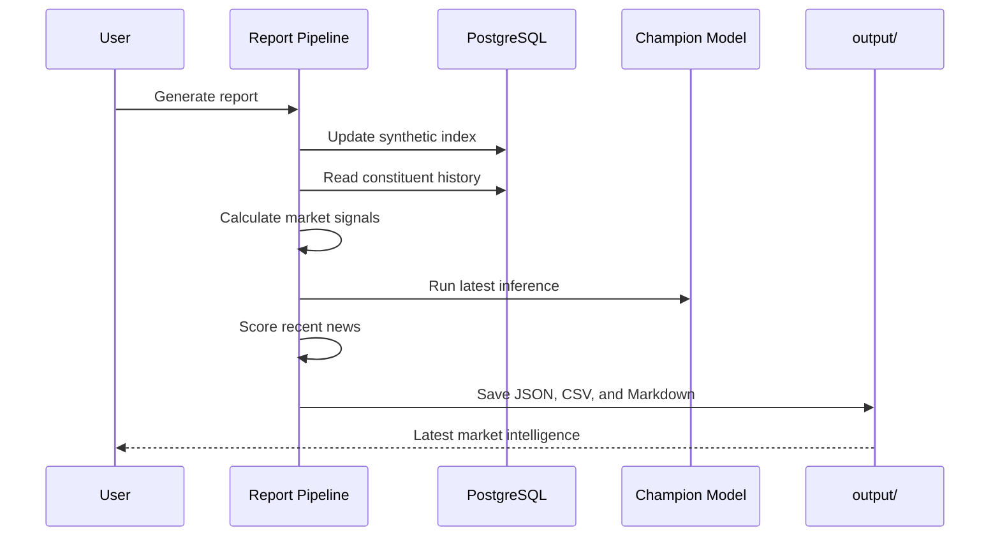

<div align="center">

<br/>

```
 ███╗   ██╗██╗███████╗████████╗██╗   ██╗    ███████╗ ██████╗
 ████╗  ██║██║██╔════╝╚══██╔══╝╚██╗ ██╔╝    ██╔════╝██╔═══██╗
 ██╔██╗ ██║██║█████╗     ██║    ╚████╔╝     ███████╗██║   ██║
 ██║╚██╗██║██║██╔══╝     ██║     ╚██╔╝      ╚════██║██║▄▄ ██║
 ██║ ╚████║██║██║        ██║      ██║       ███████║╚██████╔╝
 ╚═╝  ╚═══╝╚═╝╚═╝        ╚═╝      ╚═╝       ╚══════╝ ╚══▀▀═╝
```

### **Nifty 50 Market Intelligence Platform**
*Multi-stock deep learning · News sentiment · Market-signal research*

<br/>

[](https://www.python.org/)
[](https://pytorch.org/)
[](https://www.postgresql.org/)
[](https://fastapi.tiangolo.com/)
[](https://streamlit.io/)
[](https://www.docker.com/)

<br/>

---

```
  ┌─────────────────────┬────────────────────┬─────────────────────┬────────────────────┐
  │   Research Universe │      Model Input   │   Champion ROC-AUC  │    Baseline Lift   │
  │      50 stocks      │  48 × 5-min bars   │       0.6372        │  +0.1373 vs XGBoost│
  ├─────────────────────┼────────────────────┼─────────────────────┼────────────────────┤
  │    Feature Space    │  Market History    │  Latest Infer. Data │  Model Governance  │
  │    421 features     │    2017 – 2026     │    June 9, 2026     │ Champion/Challenger│
  └─────────────────────┴────────────────────┴─────────────────────┴────────────────────┘
```

<br/>

> ⚠️ **Research scope only.** This project evaluates predictive signal quality. It does not model
> complete execution costs and should **not** be interpreted as financial advice or deployable trading alpha.

<br/>

**Jump to:** [Quick Start](#-quick-start) · [Architecture](#-system-architecture) · [Research Target](#-research-target) · [Model Performance](#-model-performance) · [API Reference](#-api-reference) · [Project Layout](#-project-layout) · [Author](#-author)

</div>

---

## ⚡ Quick Start

### Docker (Recommended)

**1.** Clone and copy the environment template:

```bash
cp .env.example .env
```

**2.** Fill in the required values:

```env
NIFTY_API_KEY=replace-with-a-strong-random-key

DB_HOST=localhost
DB_PORT=5432
DB_NAME=nifty50
DB_USER=postgres
DB_PASSWORD=replace-with-a-strong-password

DATA_FOLDER=/app/archive/*_minute.csv
UPSTOX_ACCESS_TOKEN=
NEWSAPI_KEY=
GNEWS_KEY=
GUARDIAN_KEY=
```

**3.** Spin everything up:

```bash
docker compose up --build
```

| Service | URL |
|---|---|
| FastAPI | `http://localhost:8000` |
| OpenAPI Docs | `http://localhost:8000/docs` |
| Streamlit Dashboard | `http://localhost:8501` |
| PostgreSQL | `localhost:5432` |

---

### Local Development

**Requirements:** Python 3.11+ · PostgreSQL 15+ · Historical market files under `archive/`

```powershell
# Windows
python -m venv venv
.\venv\Scripts\Activate.ps1
pip install -r requirements.txt
```

Apply the SQL scripts in order:

```
sql/01_schema.sql
sql/02_transformation.sql
sql/03_cleaning_and_optimization.sql
```

Then load historical data:

```bash
python ingest_data.py
```

---

## 🔬 What This Platform Does

An end-to-end quantitative research system for classifying short-horizon price movements across a weighted Nifty 50 constituent basket. Every layer — from raw tick ingestion through deep-learning inference and report delivery — is implemented and validated in this single repository.

| Capability | What's Built |
|---|---|
| **Market-data engineering** | Historical ingestion, Upstox backfill, 1-min → 5-min resampling, duplicate-safe PostgreSQL writes |
| **Quantitative features** | Price action, volume pressure, constituent alignment, weighted basket construction, news context |
| **Deep learning** | Shared PyTorch LSTM across 50 stocks with index-weighted aggregation |
| **Model validation** | Chronological split, train-only normalization, class-aware loss, three baseline comparisons |
| **Model governance** | Versioned champion/challenger artifacts with metric-based promotion gate |
| **Delivery layer** | FastAPI endpoints, Streamlit research dashboard, reports, Docker Compose, scheduled news collection |

---

## 🏗 System Architecture



---

## 🎯 Research Target

The model is a **binary classifier** trained on the following question:

> *Will the weighted Nifty 50 constituent basket rise by more than **0.1%** during the next **30 minutes**?*

Each input sequence spans **48 five-minute bars** across **50 stocks**. The shared LSTM encodes every constituent using eight price/volume features, combines stock representations using configured index weights, then joins them with global market context and news features before the final classification head.

---

## 📊 Model Performance

> Numbers sourced from the protected champion artifact: `output/models/nifty50_lstm_metrics.json`

### Champion Metrics

| Metric | Value |
|---|---:|
| **ROC-AUC** | **0.6372** |
| Accuracy | 68.55% |
| F1 Score | 0.3568 |
| Positive-class Precision | 32.02% |
| Positive-class Recall | 40.30% |
| Training sequences | 136,891 |
| Evaluation sequences | 34,186 |
| Features | 421 |
| Sequence length | 48 bars |

### Baseline Comparison

| Model | ROC-AUC | Delta |
|---|---:|---:|
| Majority classifier | 0.5000 | — |
| Logistic regression | 0.5218 | +0.0218 |
| XGBoost (global features only) | 0.4999 | −0.0001 |
| **Shared LSTM** ← champion | **0.6372** | **+0.1373** |

The LSTM produces a `+0.1373` ROC-AUC lift over the saved XGBoost baseline. Accuracy is not treated as the primary metric because the positive class is imbalanced.

### Evaluation Window

| Partition | Period |
|---|---|
| Training | November 17, 2017 → January 24, 2024 |
| Evaluation | January 24, 2024 → August 6, 2025 |
| Latest saved inference data | June 9, 2026 |

The split is **chronological**. Normalization is fitted on the training partition only, and targets are shifted after splitting to reduce future leakage. The evaluation partition doubles as the early-stopping set, so these results are validation evidence rather than a final untouched holdout.

### Champion / Challenger Gate

New training runs do not silently overwrite the current champion:

```bash
python -m src.modeling --challenger
```

A challenger is promoted **only when all three conditions hold:**

- ROC-AUC strictly improves
- F1 does not decline
- Lift over XGBoost remains positive

> **Latest challenger result:** Used data through June 9, 2026. Achieved ROC-AUC `0.6365`, F1 `0.3610`.
> **Verdict: rejected** — did not beat champion ROC-AUC of `0.6372`.

### Known Research Limitations

- The current constituent universe introduces **survivorship bias**
- Walk-forward and purged cross-validation are not yet implemented
- Early stopping uses the evaluation partition (not a held-out test set)
- Brokerage, spread, slippage, turnover, and market impact are **not modeled**
- Classification performance does not establish profitable or deployable alpha

---

## 📺 Dashboard Preview

### Model Performance View

<p align="center">
  
</p>

<table>
  <tr>
    <td width="50%" align="center"><strong>News Sentiment Analysis</strong></td>
    <td width="50%" align="center"><strong>7-Day Trading Report</strong></td>
  </tr>
  <tr>
    <td>
      
    </td>
    <td>
      
    </td>
  </tr>
  <tr>
    <td>Historical news coverage, monthly sentiment, and engineered NLP features.</td>
    <td>Recent market freshness, article activity, and daily FinBERT sentiment scores.</td>
  </tr>
</table>

---

## 🔁 Report Generation Workflow



---

## 🛠 Common Commands

```bash
# ── Data ──────────────────────────────────────────────
python -m src.backfill                       # Backfill recent market candles
python -m src.synthetic_index                # Rebuild synthetic index
python -m src.signals                        # Recompute market signals

# ── Modeling ──────────────────────────────────────────
python -m src.modeling --challenger          # Train a protected challenger run
python live_inference.py --use-saved-dataset # Run inference on saved dataset

# ── Reporting ─────────────────────────────────────────
python generate_7day_report.py               # Generate all report artifacts

# ── Services ──────────────────────────────────────────
uvicorn api:app --reload --port 8000         # Launch the REST API
streamlit run src/dashboard.py               # Launch the research dashboard
```

> The Docker frontend runs `streamlit_app.py` (the API-connected report viewer).
> `src/dashboard.py` is the standalone research and model-performance dashboard.

---

## 🌐 API Reference

| Method | Endpoint | Auth Required | Description |
|---|---|---|---|
| `GET` | `/` | ✗ | Health status |
| `POST` | `/generate` | ✓ `X-API-Key` | Trigger background report generation |
| `GET` | `/report/markdown` | ✗ | Return latest report as raw Markdown |
| `GET` | `/report/data` | ✗ | Return model, signal, and news artifacts as JSON |

```bash
# Trigger a report generation job
curl -X POST http://localhost:8000/generate \
  -H "X-API-Key: your-api-key"
```

PostgreSQL advisory locking prevents concurrent report-generation jobs — a second simultaneous request receives HTTP `409 Conflict`.

---

## 📦 Generated Artifacts

```
output/
├── modeling/
│   ├── nifty50_wide_dataset.parquet
│   └── nifty50_wide_dataset_summary.json
├── models/
│   ├── nifty50_lstm_state.pt
│   ├── nifty50_lstm_metadata.json
│   ├── nifty50_lstm_metrics.json
│   ├── nifty50_lstm_latest_prediction.json
│   ├── champions/
│   └── challengers/
├── news/
│   ├── latest_news_scored.csv
│   └── latest_news_summary.json
├── signals/
│   └── latest_signals.json
└── reports/
    └── nifty50_7day_report.md
```

> Generated data and model artifacts are excluded from Git — they can be large and are environment-specific.

---

## 🗂 Project Layout

```
nifty-50-50/
├── api.py                       # FastAPI application
├── fetch_incremental.py         # News fetcher
├── generate_7day_report.py      # Report orchestrator
├── ingest_data.py               # Historical data loader
├── live_inference.py            # Inference entry point
├── streamlit_app.py             # API-connected dashboard
├── config.yaml                  # Non-secret configuration
│
├── src/
│   ├── backfill.py              # Upstox market backfill
│   ├── dashboard.py             # Standalone research dashboard
│   ├── database_manager.py      # PostgreSQL session manager
│   ├── feature_engineering.py   # 421-feature builder
│   ├── modeling.py              # LSTM + baselines + champion gate
│   ├── news_processor.py        # FinBERT sentiment pipeline
│   ├── report_agent.py          # Report assembly
│   ├── settings.py              # Pydantic settings
│   ├── signals.py               # Market signal engine
│   ├── synthetic_index.py       # Weighted index construction
│   └── update_nifty50_weights.py
│
├── notebooks/
│   ├── backfilling_data.ipynb
│   ├── decision_log.ipynb
│   ├── news.ipynb
│   └── nifty50 - 50.ipynb
│
├── sql/                         # Schema + migration scripts
├── tests/                       # pytest suite
├── archive/                     # Raw historical CSVs (gitignored)
├── news_data/                   # Fetched news (gitignored)
└── output/                      # Generated artifacts (gitignored)
```

---

## 🧪 Testing

```bash
pytest -q
```

The test suite covers: backfill parsing and chunking · news timing · sequence construction · model gradients · signal generation · concurrent report locking.

---

## ⚙️ Configuration & Automation

| Setting | Detail |
|---|---|
| Secrets | Loaded from `.env`; never committed |
| Non-secret behavior | Configured in `config.yaml` |
| Database URI shorthand | `DATABASE_URI` can replace individual DB env vars |
| FinBERT sentiment | Set `USE_FINBERT=true` when the transformer model is available |
| GitHub Actions | Schedules incremental news collection during Indian market hours — updates data only, does not deploy the dashboard |
| Dev mode | Use `dev_mode` only for quick pipeline checks; **not** for final model performance |

---

## 🔒 Security

```
⛔  Never commit any of the following:
    .env  ·  API keys  ·  access tokens  ·  passwords
    raw market archives  ·  model artifacts

    Revoke and rotate any credential that has previously
    appeared in a committed file or shared audit output.
```

---

## 🧰 Technology Stack

| Layer | Tools |
|---|---|
| Language | Python 3.11 |
| Data | pandas · NumPy · PyArrow |
| Modeling | PyTorch · scikit-learn · XGBoost |
| NLP | Transformers / FinBERT |
| Database | PostgreSQL 15 · SQLAlchemy · psycopg2 |
| Services | FastAPI · Uvicorn · Streamlit |
| Operations | Docker · Docker Compose · GitHub Actions |
| Testing | pytest |

---

## ✍️ Author

<div align="center">

<br/>

**henzlo**

*Built from scratch — data engineering through deep learning through delivery.*

<br/>

</div>

---

## 📄 License

See [LICENSE](LICENSE).

---

<div align="center">

*Nifty 50 Market Intelligence · Research use only · Not financial advice*

</div>
